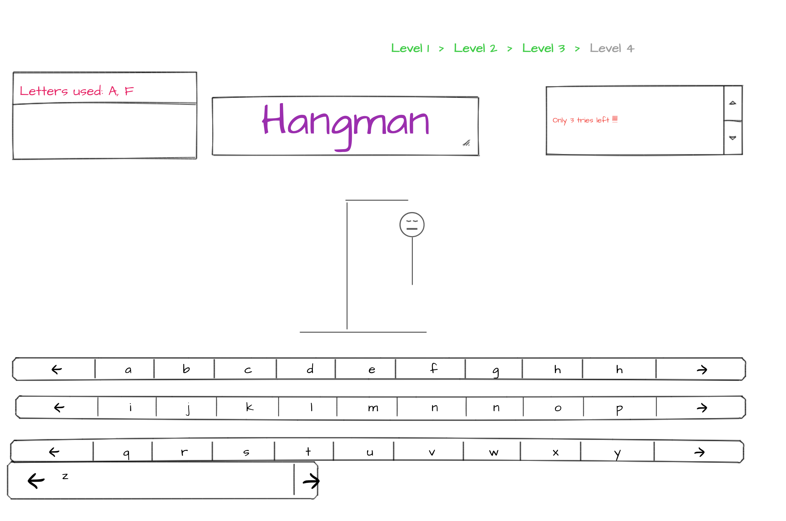

# Table of Contents

## Personal GitHub Repository
 thegcode.github.io

### General-Assembly-Project-1-Hangman

#### My Project Board
[my project trello board](https://trello.com/b/mC8HOjjN/general-assembly-project-1)

##### Hangman Wireframe

Link to Deployed App on Netlify
https://stoic-brahmagupta-51ecbc.netlify.com/

Hangman Game Objectives
Write a Hangman game that displays a secret word as a list of hidden letters. Also display an alphabet of letters that the user can guess while trying to guess the word. After a letter is used, disable that letter from the alphabet so the user will not try to guess the same letter twice. When a guess matches one or more letters in the secret word, reveal those letters to the user. Keep track of the number of incorrect guesses and end the game if the number of incorrect guesses reaches 6. If the user reveals all of the hidden letters before reaching 6 incorrect guesses, then the user wins.

Bonus Ideas:
Display a hangman as either ASCII art or images that represent the various stages of the hangman.
Display a scoreboard of how games won and lost.
Choose a theme for the game, such as "Famous Movies" or "Web Development Terms"

YouTube Videos:
https://www.youtube.com/watch?v=cGOeiQfjYPk

